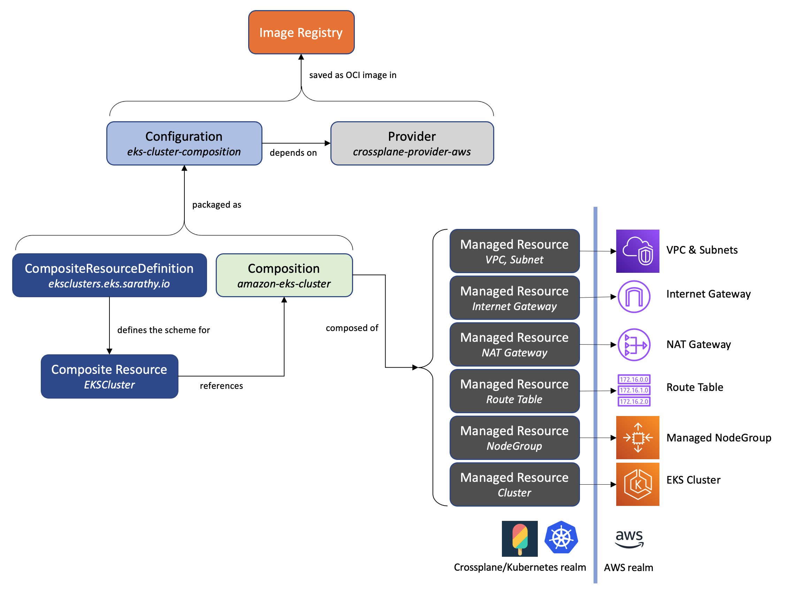

## Amazon EKS cluser management with Crossplane and Argo CD

This Git repository contains software artifacts to deploy [Crossplane](https://crossplane.io/) server and [Argo CD](https://argoproj.github.io/argo-cd/) to an Amazon EKS cluster. Please refer to this accompanying blog post for details about how this works.

### Solution overview

Here’s the high level overview of the solution architecture. 
- Start off with an Amazon EKS cluster that was created using any one of the approaches outlined [here](https://docs.aws.amazon.com/eks/latest/userguide/create-cluster.html)
- Install Argo CD on this cluster to manage all deployment tasks and point it to a Git repository containing the deployment artifacts
- Deploy Crossplane components that are needed to manage the lifecycle of AWS managed service resources  
- Deploy Crossplane-specific custom resources to provision an Amazon EKS cluster  
- Deploy a set of workloads to the new cluster  

The goal is to manage all of these tasks in a declarative style based on the [GitOps](https://www.weave.works/blog/what-is-gitops-really) approach.

### Deploy

The script [crossplane.sh](https://github.com/aws-samples/eks-gitops-crossplane-argocd/blob/main/crossplane.sh) outlined the CLI commands used in this implementation to install Crossplane and provision an Amazon EKS cluster. The implementation in this repo uses Crossplane's [Composition](https://crossplane.io/docs/v1.4/concepts/composition.html)  and [CompositeResourceDefinition](https://crossplane.io/docs/v1.4/concepts/composition.html) to create a Crossplane Configuration package that will provision the complete infrastructure for setting up an Amazon EKS cluster - VPC, subnets, internet gateway, NAT gateways, route tables, and the EKS cluster with a managed node group. The figure below shows the relationship between various Crossplane custom resources used in this Configuration package.

## Security

See [CONTRIBUTING](CONTRIBUTING.md#security-issue-notifications) for more information.

## License

This library is licensed under the MIT-0 License. See the LICENSE file.
